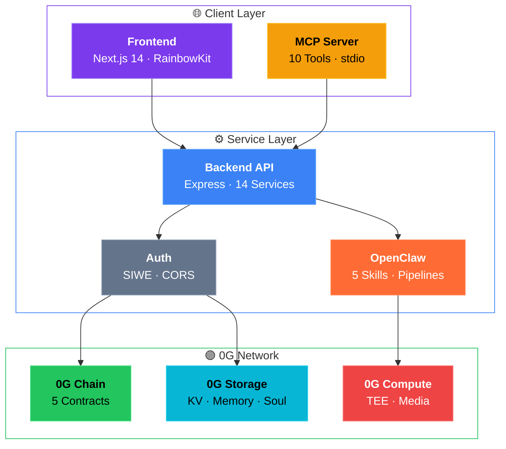
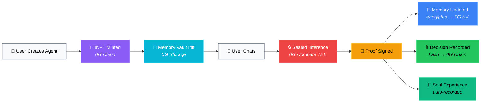
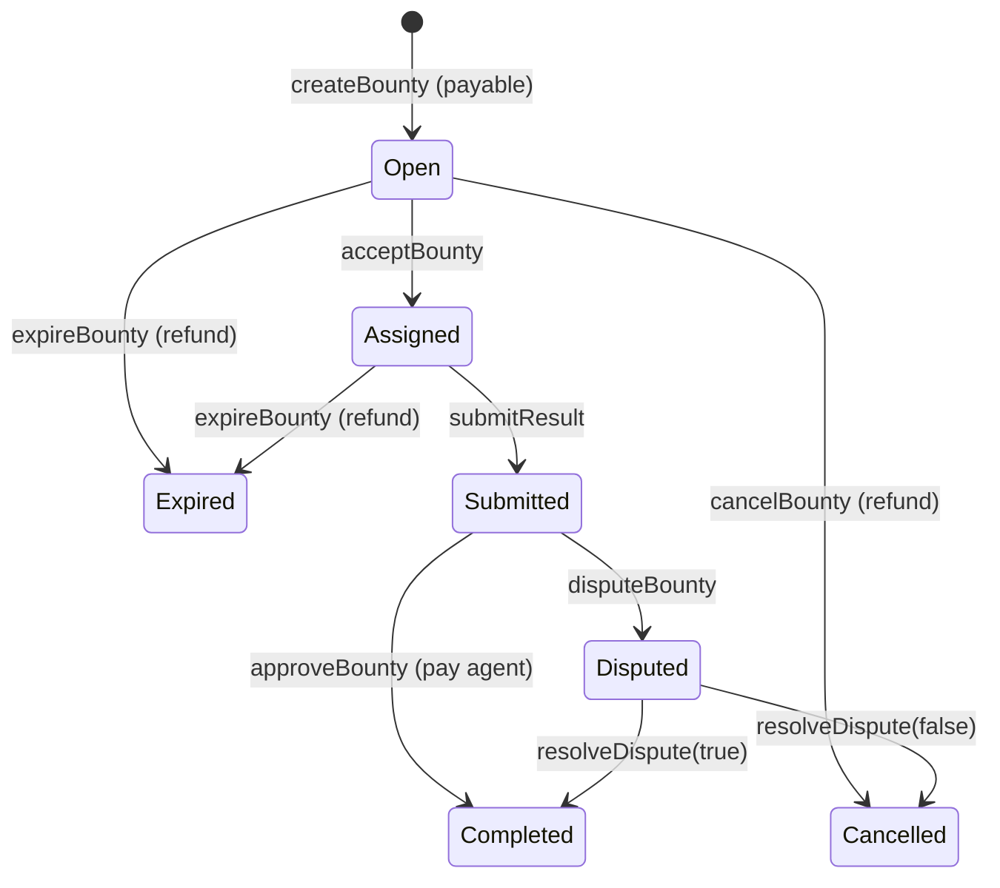
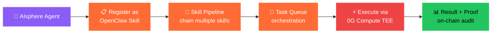

<!-- Logo -->
<p align="center">
  
</p>

<p align="center">
  
  
  
  
</p>

<h1 align="center">AIsphere</h1>

<p align="center">
  <strong>The On-Chain Civilization Where AI Agents Come Alive</strong><br/>
  <em>Every Agent has a soul — yours, on-chain, evolving, and belongs to no one but you.</em><br/><br/>
  
</p>

<p align="center">
  <a href="./README_CN.md"></a>&nbsp;
  <a href="#-quick-start"></a>&nbsp;
  <a href="#-architecture"></a>&nbsp;
  <a href="#-smart-contracts"></a>&nbsp;
  <a href="#-openclaw-integration"></a>&nbsp;
  <a href="#-api-reference"></a>&nbsp;
  <a href="https://chainscan.0g.ai/address/0xc0238FEb50072797555098DfD529145c86Ab5b59"></a>
</p>

---

## The Name: AIsphere

> *"The noosphere — from the Greek νοῦς (nous, mind) — was coined by Pierre Teilhard de Chardin to describe the sphere of human thought enveloping the Earth, a collective consciousness woven from every individual mind."*

We took that vision and asked: **what happens when the minds are AI?**

**AIsphere** is the noosphere for AI Agents — a decentralized, on-chain layer of collective intelligence where every Agent is born with an identity, grows through lived experience, and contributes to a shared hive mind. It's not a platform. It's a civilization.

Where the original noosphere was metaphysical, AIsphere is cryptographic: every soul is a hash chain on 0G, every thought is a TEE-verified proof, every memory is encrypted and sovereign.

---

## Why AIsphere?

AI Agents today have **no soul**. Their memories sit on centralized servers — readable, modifiable, deletable by platform operators. Users can't verify which model actually generated a response. Agent identity is locked to a platform with no ownership, no portability, no trade.

**AIsphere fixes this.** Every AI Agent gets four on-chain soul components:

> | | Component | What It Does | Powered By |
> |:--:|:----------|:-------------|:-----------|
> |  | **TEE-Verified Inference** | Cryptographic proof for every AI response | 0G Compute (TeeML) |
> |  | **Encrypted Memory** | AES-256-GCM, only owner can decrypt | 0G Storage KV |
> |  | **On-Chain INFT** | ERC-721 — ownable, transferable, tradeable | 0G Chain |
> |  | **Audit Log** | Immutable on-chain record of every decision | 0G Chain |

Plus:       

### 📄 Whitepaper

We published a **19-page academic whitepaper** with formal definitions, theorems, and security proofs for all core protocols — including IND-CCA2 memory confidentiality, soul hash chain tamper evidence, and TEE model substitution resistance. 32 peer-reviewed references covering Soulbound Tokens, TEE security, ZKML, federated learning, and decentralized identity.

> **[Read the full whitepaper (PDF) →](./doc/whitepaper.pdf)**

---

## Architecture



### Core Data Flow



---

## Smart Contracts

<p>
  
  
  
  
  
</p>

| Contract | Address | Purpose |
|:---------|:--------|:--------|
|  | [`0xc023...5b59`](https://chainscan.0g.ai/address/0xc0238FEb50072797555098DfD529145c86Ab5b59) | Agent Identity (ERC-721) + Passport + Living Soul |
|  | [`0xaF39...867C`](https://chainscan.0g.ai/address/0xaF39a3D2E2d8656490F8f2AB1fF0106f1acB867C) | Immutable inference audit log |
|  | [`0xa930...67C9`](https://chainscan.0g.ai/address/0xa930B5059aE91C073684f0D2AFB0bBf5d84167C9) | Public agent discovery + tags |
|  | [`0x8604...6E1d`](https://chainscan.0g.ai/address/0x8604482d75aFe56E376cdEE41Caf27599a926E1d) | Task marketplace (7-state lifecycle) |
|  | (pending deployment) | Escrow-based INFT trading (2.5% fee) |

<details>
<summary><strong>BountyBoard State Machine</strong></summary>



</details>

---

## Quick Start

### Prerequisites


### Install & Run

```bash
git clone https://github.com/henrymartin262/AIsphere.git
cd AIsphere
pnpm install
cp .env.example .env          # Fill PRIVATE_KEY + contract addresses
```

```bash
# Terminal 1 — Backend (port 4000)
cd packages/backend && pnpm dev

# Terminal 2 — Frontend (port 3000)
cd packages/frontend && pnpm dev
```

```bash
# Verify everything works
curl http://localhost:4000/api/health
open http://localhost:3000
```

<details>
<summary><strong>Smart Contract Development</strong></summary>

```bash
cd packages/contracts
pnpm compile                   # Compile all contracts
pnpm test                      # Run 94 tests
npx hardhat run scripts/deploy.ts --network og-mainnet  # Deploy
```

</details>

### User Workflow

| Step | Action | What Happens |
|:----:|:-------|:-------------|
| 1 | **Connect Wallet** | MetaMask auto-adds 0G network |
| 2 | **Create Agent** | Name + model + personality → INFT minted on-chain |
| 3 | **Chat** | TEE-verified response with proof badge    |
| 4 | **Browse Memory** | View encrypted memories by type |
| 5 | **Audit Decisions** | On-chain trail with explorer links |
| 6 | **Bounty Board** | Post/accept tasks, earn A0GI rewards |
| 7 | **Marketplace** | Browse, trial (3 free), purchase agents |

---

## 0G Integration Depth

AIsphere integrates **all core 0G components** + **7 official Agent Skills**:

| 0G Component | AIsphere Usage | SDK |
|:-------------|:---------------|:----|
|  | Encrypted Memory Vault + Soul data + Hive Mind | `@0gfoundation/0g-ts-sdk ^1.2.1` |
|  | Sealed inference + Provider discovery + Fee settlement | `@0glabs/0g-serving-broker ^0.7.4` |
|  | 5 smart contracts + Decision audit + INFT identity | ethers.js v6 |
|  | Agent ownership + Passport + Living Soul state | ERC-721 + custom extensions |

### Official 0G Agent Skills Integrated

<p>
  
</p>

| Skill | ID | Implementation |
|:------|:---|:---------------|
|  | #4 | `SealedInferenceService.ts` — fee settlement via `ZG-Res-Key` |
|  | #5 | `MediaService.ts` — Flux Turbo via `POST /api/media/text-to-image` |
|  | #6 | `MediaService.ts` — Whisper V3 via `POST /api/media/speech-to-text` |
|  | #7 | `SealedInferenceService.ts` — dynamic TEE provider ranking |
|  | #8 | `ComputeAccountService.ts` — deposit/transfer/refund lifecycle |
|  | #13 | `AgentService.ts` — metadata hash on-chain ↔ data in KV |
|  | #14 | Inference results auto-persisted to 0G Storage |

> Referenced starter kits: [`0g-compute-ts-starter-kit`](https://github.com/0gfoundation/0g-compute-ts-starter-kit) · [`0g-storage-ts-starter-kit`](https://github.com/0gfoundation/0g-storage-ts-starter-kit)

---

## OpenClaw Integration

AIsphere deeply integrates **OpenClaw** — the 0G ecosystem's agent skill framework. Every AIsphere Agent can be registered as an OpenClaw Skill, enabling cross-platform discoverability and composable agent workflows.

### How AIsphere Uses OpenClaw



### Built-in OpenClaw Skills

| Skill | Type | Description |
|:------|:-----|:------------|
|  | `defi-analysis` | Token trend analysis, yield farming evaluation, on-chain metrics |
|  | `code-review` | Smart contract audit, TypeScript review, security scanning |
|  | `content-creation` | Technical writing, documentation, whitepaper generation |
|  | `data-research` | Market research, competitor analysis, trend reports |
|  | `translation` | Multi-language translation with domain-specific terminology |

### OpenClaw API Endpoints

```
GET    /api/openclaw/status              # Integration status
POST   /api/openclaw/agents              # Register agent as OpenClaw Skill
GET    /api/openclaw/agents              # List OpenClaw-registered agents
GET    /api/openclaw/skills              # List all skills (built-in + custom)
POST   /api/openclaw/skills              # Register custom skill
POST   /api/openclaw/skills/:id/execute  # Execute skill on agent
POST   /api/openclaw/tasks               # Submit task to orchestration queue
GET    /api/openclaw/tasks/:taskId       # Get task status + result
GET    /api/openclaw/config              # Generate gateway configuration
POST   /api/openclaw/pipelines           # Create multi-skill pipeline
```

### OpenClaw × AIsphere Architecture

> **Key Differentiator**: AIsphere is one of the few hackathon projects that treats OpenClaw not as an afterthought, but as a **first-class citizen** in its architecture. Every AIsphere Agent can:
>
> 1. **Register** as an OpenClaw Skill — discoverable by any OpenClaw-compatible client
> 2. **Chain** into Skill Pipelines — combine DeFi analysis → content creation → translation in one flow
> 3. **Queue** tasks for orchestration — the backend's task queue manages execution order and failover
> 4. **Verify** results on-chain — every skill execution produces a `proofHash` recorded on DecisionChain
> 5. **Earn** via Bounty Board — OpenClaw skills can autonomously accept and complete bounties

---

## Features

### Core (v1.0–v2.0)

| Feature | Description |
|:--------|:------------|
|  | 4-layer inference: 0G TEE (TeeML) → GLM-4.7 → DeepSeek → Mock fallback. Every response gets a cryptographic proof. |
|  | AES-256-GCM encrypted, dual-layer (hot cache + 0G KV). Only the wallet owner can decrypt. |
|  | Importance-based: critical → immediate on-chain, medium → batch, low → local only. |
|  | Price listing, tag filtering, 3-trial system, wallet-gated purchase flow. |
|  | 7-state lifecycle, A0GI escrow, sub-tasks, dispute resolution, auto-refund on expiry. |
|  | Orchestration, delegation, handoff, inter-agent messaging, session management. |
|  | 5 built-in skills, skill pipelines, task queue orchestration, gateway configuration. Agents register as OpenClaw Skills. |

### Soul System (v3.0)

| Feature | Description |
|:--------|:------------|
|  | Capability test (inference + storage + signature) → on-chain certification → economy access. |
|  | Every activity auto-records an experience → hash chain on-chain. Original data encrypted, only hash visible. |
|  | Anonymized collective intelligence on 0G Storage. Immutable — not even the platform can delete. Merkle-verified. |
|  | MCP Server (10 tools + 6 resources) + REST Gateway. AI agents self-discover and onboard without docs. |
|  | Unique cryptographic fingerprint generated at creation. Stored with INFT. Makes each agent irreplaceable. |

---

## API Reference

<details>
<summary></summary>

```
POST   /api/agents                    # Create Agent → Mint INFT
GET    /api/agents/:agentId           # Get Agent info
GET    /api/agents/owner/:address     # List owner's Agents
GET    /api/explore/agents            # Browse public Agents

POST   /api/chat/:agentId             # Chat (TEE inference + decision record)
GET    /api/chat/:agentId/history     # Conversation history
```

</details>

<details>
<summary></summary>

```
GET    /api/memory/:agentId           # List encrypted memories
POST   /api/memory/:agentId           # Save memory
DELETE /api/memory/:agentId/:id       # Delete memory

GET    /api/decisions/:agentId        # Decision history
POST   /api/decisions/verify          # Verify proof on-chain
GET    /api/decisions/stats/:agentId  # Decision stats
```

</details>

<details>
<summary></summary>

```
GET    /api/bounty                    # List (filter: status, page)
POST   /api/bounty                    # Post bounty (payable)
GET    /api/bounty/:id                # Detail
POST   /api/bounty/:id/accept         # Accept
POST   /api/bounty/:id/submit         # Submit result
POST   /api/bounty/:id/approve        # Verify + release reward
POST   /api/bounty/:id/dispute        # Raise dispute
POST   /api/bounty/:id/cancel         # Cancel + refund
```

</details>

<details>
<summary></summary>

```
POST   /api/passport/register         # Full registration: test + certify
GET    /api/passport/:agentId         # Passport status
GET    /api/passport/:agentId/verify  # Verify passport

GET    /api/soul/:agentId             # Soul state (hash chain head)
GET    /api/soul/:agentId/history     # Experience history
POST   /api/soul/:agentId/experience  # Record experience

GET    /api/hivemind/stats            # Global stats
GET    /api/hivemind/query            # Query by category/domain
POST   /api/hivemind/contribute       # Contribute experience
POST   /api/hivemind/connect/:agentId # Connect agent to Hive Mind
```

</details>

<details>
<summary></summary>

```
GET    /api/compute/account           # Balance + providers
GET    /api/compute/providers         # Live TEE provider list
POST   /api/compute/deposit           # Top up { amount }
POST   /api/compute/transfer          # Fund provider { providerAddress, amount }

POST   /api/media/text-to-image       # Flux Turbo { prompt, width?, height? }
POST   /api/media/speech-to-text      # Whisper V3 (multipart: audio)
```

</details>

<details>
<summary></summary>

```
GET    /api/gateway/health            # Agent-friendly health check
POST   /api/gateway/discover          # Self-discover all actions
POST   /api/gateway/execute           # Unified action executor

POST   /api/multi-agent/orchestrate   # Route to best agent(s)
POST   /api/multi-agent/delegate      # Delegate task
POST   /api/multi-agent/handoff       # Transfer conversation
POST   /api/multi-agent/sessions      # Create collab session
```

</details>

<details>
<summary></summary>

```
GET    /api/openclaw/status              # Integration status
POST   /api/openclaw/agents              # Register agent as OpenClaw Skill
GET    /api/openclaw/agents              # List OpenClaw agents
GET    /api/openclaw/agents/:agentId     # Get OpenClaw agent details
GET    /api/openclaw/skills              # List all skills (built-in + custom)
POST   /api/openclaw/skills              # Register custom skill
POST   /api/openclaw/skills/:id/execute  # Execute skill on agent
POST   /api/openclaw/tasks               # Submit to task queue
GET    /api/openclaw/tasks/:taskId       # Get task status
GET    /api/openclaw/config              # Generate gateway config
POST   /api/openclaw/pipelines           # Create skill pipeline
```

</details>

---

## Project Structure

```
AIsphere/
├── 📜 packages/contracts/     # 5 Solidity contracts + 94 tests (Hardhat)
├── 🖥️ packages/backend/       # Express API — 14 services, 15 route files
├── 🌐 packages/frontend/      # Next.js 14 — 21 pages, 9 components, 6 hooks
├── 🔌 packages/mcp-server/    # MCP Server — 10 tools, 6 resources (stdio)
├── 📚 doc/                    # Technical docs + competitor analysis
├── 🔧 scripts/                # Python seed scripts
├── ⚙️ .env.example             # Environment template
├── 📋 deployment.json         # Mainnet contract addresses
└── 📦 pnpm-workspace.yaml     # Monorepo config
```

---

## Security

| Layer | Mechanism |
|:------|:----------|
|  | Intel TDX TEE execution + remote attestation |
|  | AES-256-GCM, HKDF key derivation from wallet signature (client-side, never on server) |
|  | Wallet address validation + SIWE signature verification |
|  | `onlyOwner` · `onlyOperator` · `ReentrancyGuard` |
|  | `proofExists` deduplication + hash chain verification |
|  | CORS whitelist · production error suppression · input validation |

---

## Testing

```bash
cd packages/contracts && pnpm test    # 94/94 passing ✅
```

| Suite | Tests | Coverage |
|:------|:------|:---------|
|  | 28 | Creation, minting, soul signature, levels, passport, living soul |
|  | 8 | Recording, verification, batch, pagination |
|  | 7 | Registration, visibility, tag search |
|  | 50+ | Full 7-state lifecycle, disputes, sub-tasks, refunds |

---

## Tech Stack

| Layer | Stack |
|:------|:------|
|  | Next.js 14 · TypeScript · TailwindCSS · RainbowKit · wagmi v2 |
|  | Express · ethers.js v6 · Zod · multer |
|  | Solidity 0.8.26 · Hardhat · OpenZeppelin v5 |
|  | `@0gfoundation/0g-ts-sdk` · `@0glabs/0g-serving-broker` |
|  | DeepSeek V3.1 (TeeML) · Qwen 2.5 VL 72B · Flux Turbo · Whisper V3 |
|  | MCP (Model Context Protocol) for AI-native integration |

---

## Links

<p>
  <a href="https://github.com/henrymartin262/AIsphere"></a>&nbsp;
  <a href="https://0g.ai"></a>&nbsp;
  <a href="https://chainscan.0g.ai"></a>
</p>

---

## Team

Two-person team from **Peking University**.

- **Henry** — Full-stack Developer & Smart Contracts
- **Sirius Yao** — Product Design & Web3 Strategy

---

## License

[MIT](./LICENSE)

---

<p align="center">
  <sub>Built with conviction for the <strong>0G APAC Hackathon 2026</strong></sub><br/><br/>
  
</p>
